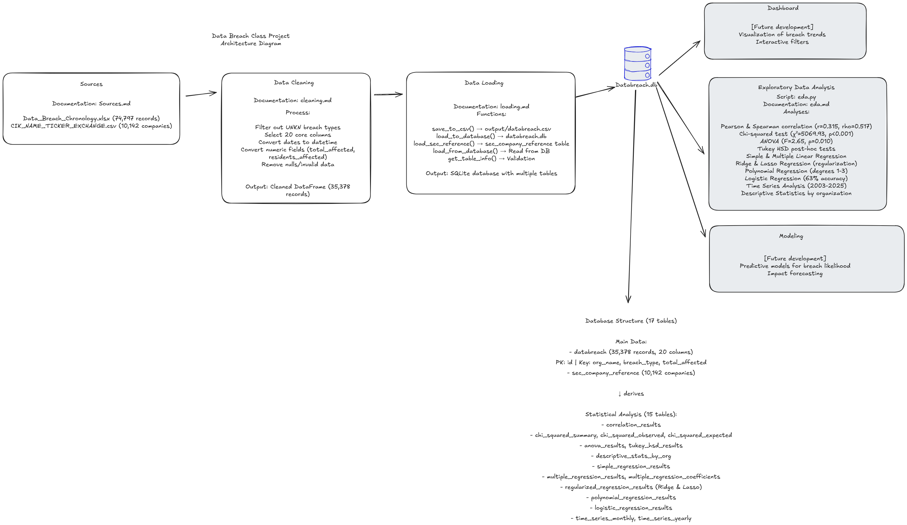

# Assignment 4: Database Design & ETL Pipeline
**Student:** T. Spivey  
**Course:** BUS 761  
**Date:** October 7, 2025

## Project Overview
Comprehensive data breach analysis system with ETL pipeline, statistical analysis, and visualization capabilities. Analyzes 35,378 breach incidents from Privacy Rights Clearinghouse (2003-2025) using advanced statistical methods.

## Architecture



The pipeline follows a four-stage process: data sourcing, cleaning, loading, and analysis with outputs to database, visualizations, and future dashboard/modeling capabilities.

## Project Structure
DataBreach/
├── dataclean.py              # Data cleaning module
├── dataload.py               # Database loading functions
├── eda.py                    # Exploratory data analysis (15 statistical tests)
├── visualizations.py         # Data visualization module (6 charts)
├── run_all.py               # Main pipeline execution script
├── CIK_NAME_TICKER_EXCHANGE.csv  # SEC company reference data
├── documentation/           # Complete project documentation
│   ├── cleaning.md          # Data cleaning process
│   ├── loading.md           # Database loading documentation
│   ├── sources.md           # Data source information
│   ├── eda.md              # Statistical analysis documentation
│   ├── ERD.md              # Database schema and ERD
│   ├── data_dictionary.md  # Complete data dictionary
│   └── setup_instructions.md # Setup and usage guide
└── output/
└── visualizations/      # 6 business-focused charts (PNG)

## Quick Start

### Prerequisites
```bash
pip install pandas openpyxl scipy scikit-learn matplotlib seaborn
Run Complete Pipeline
bashpython run_all.py
This executes:

Data cleaning (35,378 records)
Database loading (SQLite)
Statistical analysis (15 tests)

Run Individual Components
bashpython dataclean.py      # Clean data only
python eda.py           # Statistical analysis only
python visualizations.py # Generate charts only
Database
Database File: databreach.db (created by pipeline)
Tables: 17 total

databreach - Main breach records (35,378 rows, 20 columns)
sec_company_reference - SEC company data (10,142 companies)
15 statistical analysis tables:

correlation_results
chi_squared_summary, chi_squared_observed, chi_squared_expected
anova_results, tukey_hsd_results
descriptive_stats_by_org
simple_regression_results
multiple_regression_results, multiple_regression_coefficients
regularized_regression_results (Ridge & Lasso)
polynomial_regression_results
logistic_regression_results
time_series_monthly, time_series_yearly


Statistical Analyses Performed

Correlation Analysis - Pearson (r=0.315) & Spearman (rho=0.517)
Chi-Squared Test - Organization type vs breach type (χ²=5069.93, p<0.001)
ANOVA - Breach impact by organization (F=2.65, p=0.010)
Tukey HSD - Post-hoc pairwise comparisons
Simple Linear Regression - Predicting residents affected (R²=0.099)
Multiple Regression - Using organization and breach type
Ridge & Lasso Regression - Regularized models with feature selection
Polynomial Regression - Non-linear relationships (degrees 1-3)
Logistic Regression - Predicting severe breaches (63% accuracy)
Time Series Analysis - Breach trends 2003-2025
Descriptive Statistics - By organization type

Visualizations
Six publication-quality charts in output/visualizations/:

Industry vulnerability heatmap
Breach frequency analysis
Impact correlation scatter plot
Sector impact comparison
Time series trends
Regression fit visualization

Key Findings

Significant relationship between organization type and breach type (p<0.001)
Healthcare experiences 43% more disclosure breaches than expected
Financial institutions have 169% more physical breaches than expected
Retail sector targeted with 400% more card breaches than expected
Breach impact varies significantly across industries (ANOVA p=0.010)
Non-linear relationship between total and resident impact (Spearman > Pearson)

Documentation
Complete documentation available in documentation/ folder:

setup_instructions.md - Installation and usage
sources.md - Data provenance and citations
cleaning.md - Data cleaning methodology
loading.md - ETL process documentation
eda.md - Statistical analysis details
ERD.md - Database schema and relationships
data_dictionary.md - Complete field definitions

Data Sources

Breach Data: Privacy Rights Clearinghouse Data Breach Chronology v2.1
SEC Data: U.S. Securities and Exchange Commission company registry
Time Period: 2003-2025 (22 years)
Geographic Scope: United States

Technical Stack

Python 3.13
Database: SQLite
Analysis: pandas, scipy, scikit-learn
Visualization: matplotlib, seaborn

Notes
Large files excluded from Git:

Data_Breach_Chronology.xlsx (102 MB source data)
databreach.db (70 MB - recreated by running pipeline)
output/databreach.csv (62 MB - recreated by pipeline)

These files are generated when running python run_all.py.
Contact
T. Spivey - BUS 761 - October 2025